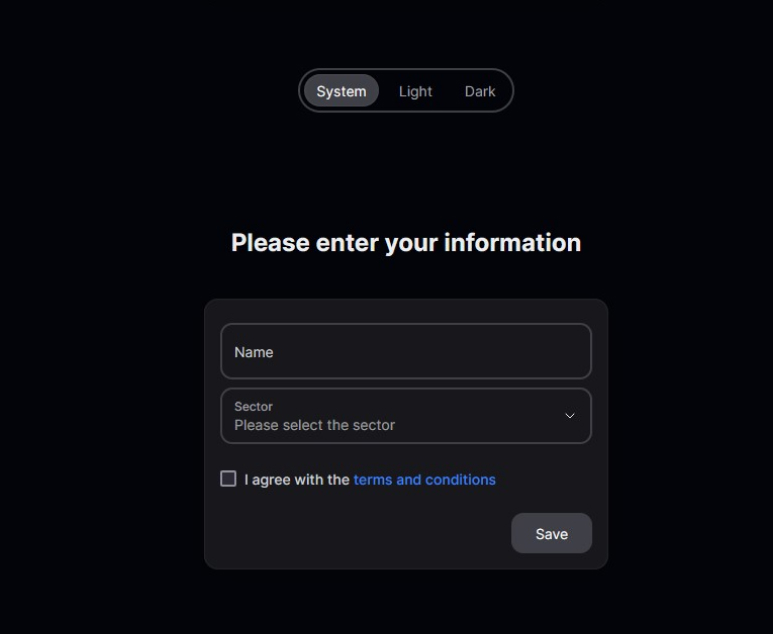
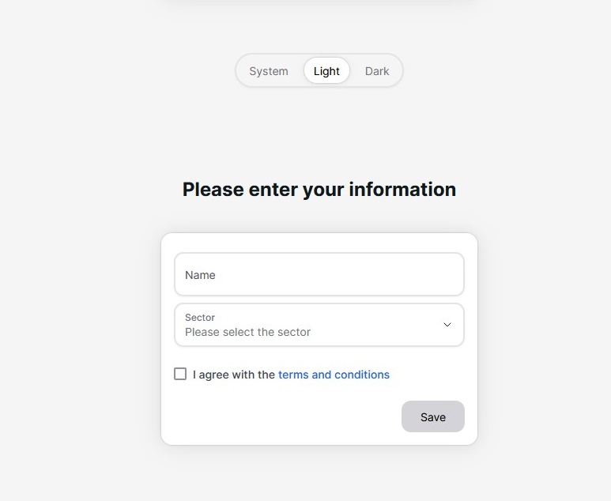

**Welcome To My GitHub**

This is a React project made with [Next.js](https://nextjs.org/) by [Topu Roy](https://www.linkedin.com/in/topu-roy/).

## About This Project

This project is a full stack nextjs web application focused on CRUD operations on a MongoDB database using the prisma ORM.

**Dark Mode Support**

**Light Mode Support**

## Technologies used in this project

-> NextJS (Main Framework) 
-> TailwindCSS (Styling) 
-> TypeScript (Type Safety) 
-> Prisma (Database ORM) 
-> MongoDB (Database) 
-> Zustand (State Management) 
-> React Hook Forms (Forms Handler)

## Deployed on Vercel

See the live deployed website [here](#)
